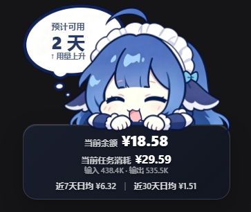

# dsh-balance

[English](#english) | [简体中文](#简体中文)

A user-level plugin for **DeepSeek Harness (dsh)** that shows a floating, draggable **DeepSeek balance card** at the top-right of the Web UI, plus an **"adjust size"** card in the *Settings → Plugins* configuration page.

- Transparent 鲸鱼娘 mascot + a floating glass card
- Estimated-days, live balance, and the selected conversation's token usage + cost (auto-switches with the active session)
- Weighted/trend daily-burn estimate from the last 7 & 30 days of usage
- Viewport boundary clamping + snap to the left/right/bottom edges
- A settings card to adjust the card width (`设置 → 插件配置 → dsh-balance`)

## English

### Requirements

- DeepSeek Harness (dsh) Web surface (`dsh web`), v0.1.0+
- Node 22+ (uses the built-in `fetch`)

### Installation

Add the plugin to your `web` profile, then register the row.

```sh
dsh plugin --profile web add <owner>/dsh-balance
```

Append to `~/.dsh/profiles/web/cordis.patch.yml`:

```yaml
- insert:
    - id: dsh-balance
      name: dsh-balance
```

Restart `dsh web` and hard-refresh the browser (`Ctrl+F5`).

> The plugin ships prebuilt (`lib/index.js` + `lib/client.js`) and bundles a default mascot image, so it works out of the box — no build step and no manual asset setup required.



### The mascot image

A default mascot (the girl / 鲸鱼娘) is bundled and served automatically. To use a different one, place a transparent PNG at `~/.dsh/.dsh-balance-mascot.png` (refreshed live with `no-store`, so a swap needs only a browser refresh), or override the path with the `DSH_BALANCE_MASCOT` env var. If none is set, the bundled default is used.

### Pricing

The estimated-days cost uses per-model unit prices. See `~/.dsh/.dsh-balance-pricing.json` (created on first run) to set the before/after-2026-08-17 tier prices per million tokens (CNY).

### How it works

- `/dsh-balance-card` returns the balance, the weighted/trend estimate, and `config.width`; the browser scales the card from it.
- `/dsh-session-usage?sessionId=…` returns the selected conversation's token usage + cost.
- The settings namespace `dsh-balance` (schema `{ width }`) is registered by the host and editable from *Settings → Plugins*.

---

## 简体中文

### 功能

为 **DeepSeek Harness (dsh)** 的 Web 界面新增一个**可拖动的悬浮余额卡片**（默认在右上角），并在 *设置 → 插件 → 插件配置* 里提供一张**调整大小**的配置卡。

- 透明鲸鱼娘素材 + 悬浮玻璃卡片
- 显示**预计可用天数、实时余额**，以及当前选中对话窗口的**任务用量与消耗费用**（随会话切换自动更新）
- 基于近 7 天与近 30 天用量的**加权/趋势日均消耗**来估算剩余可用天数
- **视口边界钳制**（不会拖出屏幕）+ 靠近左/右/下边**自动吸附**
- 一张**调整大小**的设置卡（`设置 → 插件配置 → dsh-balance`）

### 环境要求

- DeepSeek Harness (dsh) Web 界面（`dsh web`），v0.1.0+
- Node 22+（使用内置 `fetch`）

### 安装

将插件加入 `web` profile，并注册插件行。

```sh
dsh plugin --profile web add <owner>/dsh-balance
```

在 `~/.dsh/profiles/web/cordis.patch.yml` 追加：

```yaml
- insert:
    - id: dsh-balance
      name: dsh-balance
```

重启 `dsh web` 并强刷浏览器（`Ctrl+F5`）。

> 插件已预构建（`lib/index.js` + `lib/client.js`），并**自带默认鲸鱼娘素材**，开箱即用——无需构建、无需手动放置素材。


### 素材图（可选）

默认已打包鲸鱼娘素材，自动提供。如需换成其他图：把透明 PNG 放到 `~/.dsh/.dsh-balance-mascot.png`（改动实时生效，`no-store`，强刷即可），或用 `DSH_BALANCE_MASCOT` 环境变量指定路径。若未设置，则使用打包的默认图。

### 单价配置

"预计可用天数"按各模型单价估算。首次运行后编辑 `~/.dsh/.dsh-balance-pricing.json` 可设置 2026-08-17 前/后两档的每百万 tokens 单价（CNY）。

### 工作原理

- `/dsh-balance-card` 返回余额、加权/趋势预估与 `config.width`，浏览器据此缩放卡片。
- `/dsh-session-usage?sessionId=…` 返回所选会话的用量与费用。
- 宿主注册 `dsh-balance` 设置命名空间（schema 为 `{ width }`），可在 *设置 → 插件* 中编辑。

---

## License / 许可证

[MIT](./LICENSE)
